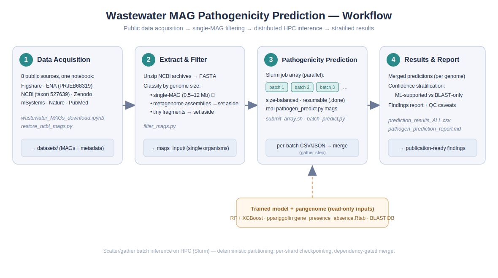
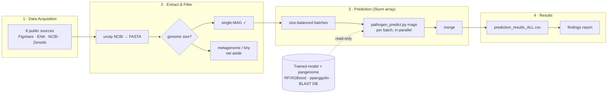

<p align="center">
  
</p>

# Wastewater MAG Pathogenicity Prediction

This repository contains a reproducible, HPC-scale pipeline that screens **wastewater metagenome-assembled genomes (MAGs)** for bacterial pathogenicity. It acquires MAG/assembly datasets from eight public sources, filters them down to single-organism genomes, runs per-organism pathogenicity inference as a **distributed Slurm job array**, and reduces the results into a single stratified table plus a findings report.

The machine-learning model and pangenome used for inference are produced by the companion project [`complete-chromosome-pathogen-non-pathogen-genomes`](https://github.com/) (RF + XGBoost over a ppanggolin gene-family presence/absence matrix); this repository is the **downstream application** of that model to wastewater MAGs.

---

## 🧭 Overview

The workflow is organized as four numbered steps, each in its own folder with an `outputs/` directory for that step's products:

| Step | Folder | What it does |
|------|--------|--------------|
| 1 | `01_data_acquisition/` | Download all datasets from public archives into `datasets/` |
| 2 | `02_extract_and_filter/` | Unzip NCBI genomes and keep only single-MAG-sized FASTA |
| 3 | `03_pathogenicity_prediction/` | Distributed per-organism prediction on HPC (Slurm array) |
| 4 | `04_results_and_report/` | Merged predictions + interpretation report |

---

## 🔁 Pipeline at a Glance



---

## 📂 Repository Structure

```
wastewater-mag-pathogenicity-prediction/
├── README.md
├── docs/
│   ├── workflow.svg              # workflow diagram (shown above)
│   └── workflow.mmd              # editable Mermaid source
├── 01_data_acquisition/
│   ├── wastewater_MAGs_download.ipynb   # notebook: fetch all 8 sources
│   ├── restore_ncbi_mags.py             # re-fetch missing NCBI genomes (resumable)
│   └── outputs/                          # -> datasets/ land here
├── 02_extract_and_filter/
│   ├── filter_mags.py            # keep single-MAG-sized FASTA; set aside metagenomes
│   └── outputs/
├── 03_pathogenicity_prediction/
│   ├── submit_array.sh           # ONE command: size batches -> submit array + merge
│   ├── run_pathogen_array.sbatch # Slurm array (one batch per task)
│   ├── merge_results.sbatch      # dependency-gated merge job
│   ├── batch_predict.py          # orchestrator: batching, resume, merge (calls the real tool)
│   └── outputs/                  # -> per-batch results + prediction_results_ALL.csv
├── 04_results_and_report/
│   ├── prediction_results_ALL.csv       # merged per-organism predictions
│   └── pathogen_prediction_report.md    # findings + QC caveats
├── utils/
│   ├── build_tree_view.py        # static HTML tree of a data directory
│   └── tree_server.py            # live HTML file browser for large HPC dirs
└── envs/
    └── environment.yml           # conda environment
```

---

## ⚙️ Requirements

- **Python ≥ 3.10** with: `pandas`, `numpy`, `scikit-learn`, `xgboost`, `biopython`, `requests`, `tqdm`
- **Bioinformatics tools** (conda / bioconda): `ppanggolin`, `blast`
- **HPC**: a Slurm cluster (this pipeline was developed on one with a `compute` partition); the array step is designed for it.
- The trained model artifacts (`saved_model/`) and pangenome (`pangenome.h5`, `gene_presence_absence.Rtab`) from the companion project.

```bash
conda env create -f envs/environment.yml
conda activate pathogen_ml
```

---

## 🚀 Getting Started

```bash
git clone https://github.com/<your-org>/wastewater-mag-pathogenicity-prediction.git
cd wastewater-mag-pathogenicity-prediction
```

Set two paths once (edit the scripts' `NCBI_DIR` / `PIPE_DIR`, or export them):

```bash
export NCBI_DIR="$HOME/datasets/04_ncbi_wastewater_metagenome_527639"   # working data dir
export PIPE_DIR="$HOME/.../complete-chromosome-pathogen-non-pathogen-genomes"  # companion repo (model + pangenome)
```

---

## 1️⃣ Data Acquisition

Fetch every dataset from its public archive into `datasets/` (one folder per source; resumable and md5-verified):

```bash
jupyter notebook 01_data_acquisition/wastewater_MAGs_download.ipynb
# NCBI genomes only, or to backfill missing ones:
python 01_data_acquisition/restore_ncbi_mags.py
```

**Expected structure**

```
datasets/
├── 01_figshare_5cities_becsei/
├── 02_ena_PRJEB68319_assemblies/
├── 03_msystems_resistome/
├── 04_ncbi_wastewater_metagenome_527639/
│   └── genomes/            # NCBI genome .zip archives
├── 06_pubmed39215001_timeseries/
├── 07_nature_s41467_MAGs/
└── 08_biorxiv_666059_reanalysis/
```

---

## 2️⃣ Extract & Filter

Unzip the NCBI archives to FASTA and keep only single-organism-sized genomes (the whole-metagenome co-assemblies are set aside, since per-organism prediction requires one genome per file):

```bash
python 02_extract_and_filter/filter_mags.py
```

**Expected structure**

```
04_ncbi_wastewater_metagenome_527639/
├── mags_input/               # single-MAG FASTA -> input to Step 3
├── metagenome_assemblies/    # set aside (would need read-based binning)
├── tiny_fragments/           # set aside (< 0.5 Mb)
└── mags_size_profile.tsv     # size class per genome (for the record)
```

---

## 3️⃣ Pathogenicity Prediction (HPC / Slurm)

One command sizes the batches, submits the parallel array, and queues the dependent merge:

```bash
module load slurm            # if needed
bash 03_pathogenicity_prediction/submit_array.sh
```

- Genomes are packed into **size-balanced batches** (~800 MB each) so a few large genomes don't stall a batch.
- Each batch is one **array task** running the real `pathogen_predict.py mags`; ~20 run concurrently.
- Every batch writes a `.done` sentinel → the job is **resumable**: resubmit to continue after a timeout, skipping finished batches (exactly-once per batch).
- A dependency-gated merge combines per-batch CSVs into `prediction_results_ALL.csv`.

**Monitor**

```bash
squeue -u $USER
watch -n30 'ls "$NCBI_DIR"/pathogen_results_perorg/batches/*/.done 2>/dev/null | wc -l'
cat "$NCBI_DIR"/pathogen_results_perorg/status.txt
```

**Expected structure**

```
pathogen_results_perorg/
├── batches/
│   ├── batch_0001/{input/, output/prediction_results.csv, .done, batch.log}
│   └── ...
├── prediction_results_ALL.csv     # merged (per-organism)
├── prediction_results_ALL.json
└── status.txt
```

---

## 4️⃣ Results & Report

The merged table `04_results_and_report/prediction_results_ALL.csv` holds one row per genome (ML ensemble probabilities + top-5 BLAST references). See [`pathogen_prediction_report.md`](04_results_and_report/pathogen_prediction_report.md) for the full findings and important interpretation caveats (confidence stratification, the asymmetric BLAST-only fallback, and a CSV schema note).

---

## 🗂️ Data Availability

| Source | Accession / DOI | Content |
|--------|-----------------|---------|
| Figshare | [10.6084/m9.figshare.25016147](https://doi.org/10.6084/m9.figshare.25016147) | 5-city sewage data descriptor (abundances, ARGs, MAG tables) |
| ENA | [PRJEB68319](https://www.ebi.ac.uk/ena/browser/view/PRJEB68319) | Assemblies / MAGs (time-series sewage) |
| NCBI | [taxon 527639](https://www.ncbi.nlm.nih.gov/datasets/genome/?taxon=527639) | "wastewater metagenome" genome assemblies (2024–2026) |
| Zenodo | [14652833](https://zenodo.org/records/14652833) | Sewage read-based ARG mapstat files |
| mSystems | [10.1128/msystems.00031-26](https://journals.asm.org/doi/full/10.1128/msystems.00031-26) | Urban sewage resistomes (supplementary) |
| Nature Comms | [s41467-024-51957-8](https://www.nature.com/articles/s41467-024-51957-8) | Time-series sewage metagenomics (MAGs → PRJEB68319) |
| PubMed | [39215001](https://pubmed.ncbi.nlm.nih.gov/39215001/) | Same study (research article) |
| bioRxiv | [2025.07.21.666059](https://www.biorxiv.org/content/10.1101/2025.07.21.666059v1) | Reanalysis (no new data) |

---

## 🧪 Utilities

- `utils/build_tree_view.py` — generate a self-contained, interactive HTML tree of any data directory (file counts, sizes, type icons, search).
- `utils/tree_server.py` — a tiny live HTML file browser for very large HPC directories (lazy, on-demand listing over an SSH tunnel).

---

## 📝 Notes

- All paths are relative to the working data dir (`NCBI_DIR`) and the companion model dir (`PIPE_DIR`); set these before running.
- Large data (the datasets and per-batch outputs) are **not** committed — keep them on scratch/HPC storage; the repo holds code, the workflow, and the merged result + report.
- The prediction step is designed for HPC: partitioning is deterministic (rerun-stable), work is checkpointed per batch, and the merge is dependency-gated — so timeouts never lose completed work.
- **Interpretation caveat:** the raw `PATHOGEN` rate is inflated by an asymmetric BLAST-only fallback and out-of-distribution inputs — read `pathogen_prediction_report.md` before quoting numbers.

---

## 📧 Contact

For questions, please open a GitHub issue.
